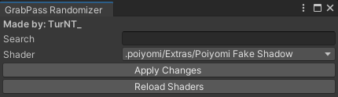

# GrabPass Randomizer

A small Unity editor tool that gives a shader's named GrabPass a unique name, so it stops
colliding with everyone else's.

Free. No dependencies. One file.



## The problem

A named GrabPass is captured once per frame per unique name, across every material in the
scene. That's why named grabs are cheaper than unnamed ones — and also why two shaders that
happen to use the same name end up sharing one capture.

In practice that means any shader shipped with a common grab name (`_GrabTexture`,
`_GrabPassTexture`, `_BlurGrab`) will quietly interact with someone else's shader the moment
both are in the same world or on the same avatar. Effects capture each other, layer in the
wrong order, or sample a frame that another shader already wrote to.

Renaming the grab to something nothing else will ever pick fixes it.

## Install

Either import the `.unitypackage` from
[Releases](../../releases), or drop `TurNT_GrabPassRandomizer.cs` anywhere inside an `Editor`
folder:

```
Assets/!TurNT_/Tools/GrabPass Randomizer/Editor/TurNT_GrabPassRandomizer.cs
```

The file is wrapped in `#if UNITY_EDITOR`, so it won't break a build if it ends up somewhere
else, but an `Editor` folder is the right home for it.

## Usage

**TurNT_Tools > GrabPass Randomizer**

1. Type in the search box to narrow the list (matches anywhere in the shader's declared
   name or its asset path, case insensitive).
2. Pick a shader from the dropdown.
3. **Apply Changes.**

You get a new `.shader` file next to the original, named `Original_481920.shader`, and it's
pinged in the Project window when it's done. The Console prints every rename it made.

Run it again on the same source shader to get another variant with a different number. Nothing
is overwritten — each run picks an unused suffix.

## What it actually changes

- Every reference to the grab texture: the `GrabPass { }` block, the `sampler2D` declaration,
  and any sampling macro. `_MyGrab` becomes `_MyGrab_481920` everywhere it appears as a whole
  identifier — `_MyGrabBlur` is left alone.
- The `Shader "..."` declaration, so the variant doesn't collide with the original in Unity's
  shader list. `Author/Glass` becomes `Author/Glass_481920`.
- Nothing else. The source shader is never modified.

Because the shader name changes, existing materials keep pointing at the original. Re-assign
them to the variant if that's what you want.

## Known limits

**Unnamed GrabPass can't be randomized.** `GrabPass { }` has no name to rewrite — it captures
into `_GrabTexture` implicitly. Give it a name first; you want one anyway, since unnamed grabs
re-capture on every draw.

**Grab declared in a `.cginc`.** If the sampler lives in an include rather than the `.shader`,
the copy still points at the original include file and the renamed grab won't bind. The tool
detects this and logs a warning naming the file. Move the declaration into the shader, or
duplicate and rename the include yourself.

**Docked windows ignore the auto-sizing.** The window fits itself to its content when floating.
Unity ignores `minSize`/`maxSize` on docked windows, which is normal.

## Requirements

Unity 2022.3 LTS, Built-in Render Pipeline. Nothing about it is VRChat-specific — it's a text
transform on a `.shader` file — but grab name collisions are mostly a VRChat problem, so that's
what it was written for.

## Why this is free

I wrote this as a gift for a friend. He's now selling it for $15, with "made my own that I
could sell, don't worry didn't skid anything".

The version he's selling has a disclaimer at the bottom promising no shaders were "uploaded,
stolen, blessed, cursed, or emailed" during the process. Nothing in his tool uploads. Nothing
emails. Nothing blesses.

Mine did. The Blessing Level slider was a joke I wrote. So were the fake "auto-upload to
TurNT's secret GitHub" and "send Unity package to TurNT@shaderthief.com" toggles. He kept the
punchline to a joke he never wrote the setup for.

Running someone else's work through an LLM doesn't make it yours. It makes it their work with
the serial numbers filed off, and you can always see the filing marks.

So here's the real thing, for free. If you paid for it, go get your money back.

## License

MIT. Do what you like with it — including selling it, honestly. Just don't tell people you
wrote it.
